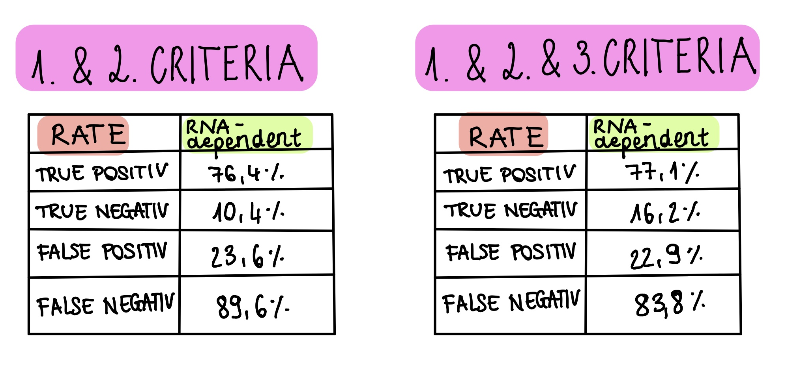
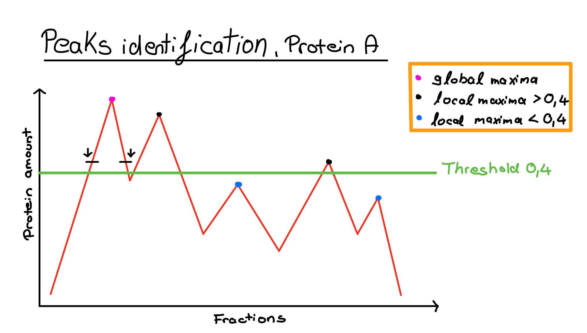

```{r setup, include=FALSE}
library(knitr)
knitr::opts_chunk$set(echo = TRUE)
```

<br>


<center> 
# **<span style="color: magenta;">DATA ANALYSIS PROJECT SS22 </span>**

## **Proteome-wide Screen for RNA-dependent Proteins** 

## __Topic 03, Team 04__


### *Deadline: 18.07.2022*


```

Supervisor: Dr. Maïwen Caudron-Herger

Tutor: Niklas Engel

```
### **Molecular Biotechnology 4.FS** 

```

Khalida Dushimova, Greta Karathanos, Richard Efraim Langi, Madleen Piegsa

```


# 1. Introduction
RNA-dependent proteins are defined as RNA-dependent when their interactome depends on RNA. This large group of proteins plays the key roles in RNA processing and modification (Alternative splicing, RNA editing and polyadenylation), export, mRNA localization and translation. 
The malfunction of RNA-dependent proteins underlies the origin of many diseases from muscular atrophies and neurological disorders to cancer.  Therefore, it is necessary to increase the number of recognized RNA-dependent proteins and the understanding of their molecular mechanisms. Since identifying molecular mechanisms is one of the biggest challenges in (nc)RNA (-> non-coding), research M.Caudron-Herger et al. created R-Deep to detect RNA-dependent proteins automatically. In general, R-Deep is a proteome-wide, unbiased, and enrichment-free screen based on density gradient ultracentrifugation (Caudron-Herger et al., 2019). Performing R-Deep, lysates with a previous RNase treatment (RNase group) and without a previous RNase treatment (Ctrl group) were separated by their density. Each fraction was analyzed by mass spectrometry or western blot according to its protein amount (Caudron-Herger et al., 2020). Detected RNA-dependent proteins can bind directly to the RNA (RBP) or bind to RBPs.


# 2. Materials and Methods

## 2.1 RDeep
R-DeeP is a proteome-wide, unbiased and enrichment-free screen. The principle of R-DeeP is based on cellular lysate fractionation by density gradient ultracentrifugation. (Referenz) The outcome is analyzed by proteome-wide mass spectometry or individual western blotting. In general, R-DeeP is used to determine RNA-dependent proteins, that interact directly or indirectly with RNA. Lysates with (RNase group) and without (Ctrl group) RNase treatment are compared. By that differences in molecular weight, hence and the size of the complexes are determined.RBPs are expected to split after RNase treatment and migrate to different fractions in a sucrose density gradient.


## 2.2 Dataset exploration
Our given dataset consists of mass-spectrometry data from non-synchronized A549 cells which are human lung carcinoma cells of a caucasian male. In general, the data show the protein amount of each of our 3680 human proteins per fraction. The RDeep screen has been repeated three times so it comprises three replicates for each sample. All in all, we got 3680 rows with one human protein per row and 150 columns for our Ctrl and RNase group for 25 fractions and three replicates each. 


## 2.3 First Normalization (fractionwise)
The total amount of protein of every replicate should be similar. In our given dataset this was not the case. Normalization is the process to account for the bias and make samples more comparable. The aim was to change the values of columns to a common scale without distorting differences in the range of values and by this reduced the variation between our three technical replicates.
Therefore, for our first normalization, we compute the sums fractionwise and find the two closest sums. We then define normalization factors for the replicates. The quotients of the mean sums and sums of replicates are the normalization factors. 


## 2.4 Second Normalization (anti-outlier function)
For our second normalization, we defined the mean out of the two most similar replicates and by this wrote our own function to exclude outliers. The outliers were found, removed, and replaced by the mean of the other two most similar replicates. 


## 2.5 Peaks identification
Peaks We expect RNA-dependent proteins to migrate to different positions in the RNase-treated sample compared to the Ctrl sample. As a next step, we identify the maxima in both samples to characterize a protein as RNA dependent or RNA independent. We detected the local and the global maxima to draw all the biological information we could get from our given values. Our theoretical maximum is a point x whose neighboring values have to be smaller [1]. 

The method is based on checking the neighbors of each fraction. For the first fraction, only the right neighbor will be compared because there is no left neighbor. For the second to twenty-fourth fraction, both left and right neighbours will be compared. For the last fraction, only the left neighbour will be compared since the right neighbour doesn't exist. If the checked fraction has higher values than the neighbor(s), then the fraction is a maximum. If the the checked fraction have lower values than the neighbour(s), then the fraction is not a maxima and will be zero-ed in our code.


## 2.6 Criteria for RNA dependency

### 2.6.1 T-Test of absolute maxima
T Test is a statistical test under the null hypothesis and can be used to determine the significance of the data. For our data, a two-sided unpaired T-Test is performed with Bonferroni correction. The Bonferroni correction is a method to adjust the significance level α to avoid a type I error (rejecting the null hypothesis when you should not) when performing multiple statistical tests. The formula for a Bonferroni-correction is as follows:  $α_{new} = α_{originial} / n$. T-Test allows us to determine if the global maxima of each of the proteins (all replicates) between the Ctrl and RNase group have a significant difference. We declare a significant difference between both groups as RNA-dependent. It will be our first criterion for RNA dependency. 


### 2.6.2 K-Means Clustering (Y-shift and X-shift detection):
K-Means Clustering is an unsupervised non-linear algorithm that clusters data based on similarity. It aims is to partition the observations into a previously defined number of clusters. We define this number by performing the elbow method. 
Through K-Means Clustering and comparing our t-test results, we define selection criteria (Y-shift and X-shift) to determine RNA-dependent proteins. Y-shift is the difference in protein amount between the global maxima of the Ctrl and RNase group. X-shift is the difference of locations of global maxima (fraction) between the global maxima of the Ctrl and RNase group. 

If the X- and Y-shift have positive values (left and down shift), we define the protein as RNA dependent. If the X- and Y-shift have negative values or are close to zero (right and up shift), we define the protein as RNA independent. These shifts will be our second criteria for RNA dependency. We also combined our X- and Y-shifts in a data frame and used the elbow method to determine the optimal number of clusters.	


### 2.6.3 T-Test of local maxima:
To find more RNA dependent proteins, we will include a 3rd criteria to classify the protein as RNA dependent. The 3rd criterion is the result of the t-test of local maxima. The same T Test principle from global maxima is used.


## 2.7 Comparison with other databanks:
To calculate the true positive and true negative rate and see how good our criteria find the RNA dependent proteins we compare our findings with mammalian RNA-binding protein resources (https://r-deep.dkfz.de)


## 2.8 Linear regression:
Finally, we perform a linear regression. This model can generally be used to model the relationship between a dependent variable (regressand) and one or more explanatory variables (predictors). The relationship is represented by a linear function. We can see from the model to what extent the dependent variable can be explained by the other variables. 
Our regression model predicts the Y-Shift values with the information from correlation between Ctrl and RNase.


## 2.9 Working with complementary data:
We used an additional data bank from our tutor, Niklas Engel for our second linear regression. The other one is from RDeep website and is used to compare our results with it.


# 3. Results 

## 3.1 Data Reorganization
The raw data was split into two data frames, one for Ctrl group **Ctrl** and one for RNase **RNase** group. Each group consists of 25 rows representing the fractions and 11040 columns representing the 3680 proteins including the 3 Reps.


## 3.2 Data Evaluation
For further analysis of the replicates, we summed up the total protein amount of all genes per replicate and plotted them side by side in a bar chart. The total protein amount between each Reps of Ctrl and RNase samples is very variable.


## 3.3 First Normalization
The results of our first normalization can be found in 2 data frames, **Norm_Ctrl** for Ctrl group and **Norm_RNase** for RNase group, each with 11040 rows representing the proteins with 3 Reps and 25 columns for the fractions. To check the results of our normalization, a bar chart of total protein amount on the y-axis and each Rep of Ctrl and RNase was created. The plot before normalization can be seen in [2].


The bar chart revealed that the three replicates of Ctrl and RNase have the same total amount. The chart also showed that although the protein amount of all three replicates of Ctrl and RNase is equal and there is a difference between the total amount of Ctrl and RNase.


## 3.4 Second Normalization
The results of our second normalization from our **df_combi_function** can be found in 2 data frames, **tCtrl_combi_df** for Ctrl group and **tRNase_combi_df** for RNase group, each with 11040 columns representing the proteins with 3 Reps and 25 rows for the fractions. To check the results of our normalization, 3 graphs of 3 reps of a Protein **MICA_Human_Ctrl** before and after normalization with the fractions on x-axis and the protein amount on y-axis were produced. The plot of before normalization can be seen in [3].


The 3 graphs of normalized replicates revealed that the replicates have a similar amount of protein and there are no more significant outliers left.


## 3.5 Peaks Identification: 
Using our self-written **maximafunction**, 9 data frames were received and each of them had a different threshold. **maxima_Ctrl_i** is the result for the Ctrl group and **maxima_RNase_i** for the RNase group, where **i** represents the percentage of global maxima (threshold). **i** has values between 0.1 - 0.9. The data frames consisted of 11040 columns representing proteins including reps and 25 columns for fractions. The values of protein amount of global (absolute) and local maxima were presented whereas no maxima are zero-ed. Our self-written **maxnum_plot_col** produced a plot, which plotted a random protein with all thresholds on the x-axis and the number of maxima on the y-axis. An example plot can be seen in [4].


## 3.6 Criteria for RNA dependency

### 3.6.1 T-Test of Global and Local maxima:
A data frame **test** with 3680 rows and one column was produced after performing a t-test of global maxima between Ctrl and RNase group. The rows represented the names of the proteins and were alphabetically ordered. The column represented the RNA dependency with two kinds of results, TRUE or FALSE.

For the t-test of local maxima, the results were presented in a data frame **test_0.4** that consists of 3680 rows and 1 column. The name of the proteins was shown in the rows and the only column explained the RNA dependency. Three outcomes were generated, TRUE, FALSE or NA.


### 3.6.2 K-Means Clustering
To find the optimal number of clusters, a plot of elbow method was used, where the x-axis represented the number of clusters and the y-axis the total within clusters sum of squares. The elbow method revealed a hard kink for three clusters.


The result of k means clustering was shown in **km**. The values of our within-cluster sum of squares of our 3 clusters were 2.275488e^15^, 2.637920e^15^ and 3.487322e^15^. Then, a plot of the y-shift on the y-axis and x-shift on the x-axis was created to better visualize the cluster. The second cluster had the most data points, then the first cluster and lastly the third cluster with interestingly only 4 data points. What is noticeable is that the second cluster has mostly positive x and y shift values.


### 3.6.3  Comparison with Data Bank with two Criteria
The results of the RNA dependent proteins (2 Criteria) were presented in 2 data frames. 305 proteins **Ctrl_Dependent_Abmax_1** were identified when one of the two criteria was fulfilled and 63 proteins **Ctrl_Dependent_Abmax_2** when both criteria were fulfilled. 

To check how many RNA dependent proteins were "correctly" identified, our results were compared with a data bank **table_RBP_lists.csv** from RDeep website. Out of 63 identified RNA-dependent proteins that fulfill both criteria, 58 had a match with the comparable data bank when both criteria are fulfilled (**RDeep_2**) and for either criteria fulfilled out of 305 identified proteins 233 have matches (**RDeep_1**). Unfortunately, our applied criteria could not identify 2017 RNA dependent proteins (**Not_identified_RDeep_1**).


### 3.6.4  Comparison with Data Bank with three Criteria
The results of the RNA dependent proteins (3 Criteria) were presented in a data frame **dependent_3** where 472 proteins were classified as RNA-dependent. Out of 472 identified RNA-dependent proteins that fulfill either criteria, 364 had a match (**RDeep_3**). Unfortunately our applied criteria could not identify 1886 RNA dependent (**Not_identified_RDeep_3**).


## 3.7 Linear Regression
The first linear regression was performed between the correlation of Ctrl and RNase absolute maxima for the x-axis and y-shift for y-axis. The linear equation from the regression was $y = 1690907x - 1184175$. The p-value for the predictor variable y was 7.98e^-06^ and for x is 5.96e^-09^. The p-value of our model was 5.962e^-09^ (**lm**). The linear regression can be seen in [5]. The QQ plot of the theoretical and sample residues aligned with the QQ line except when the theoretical quantiles were below -2.5 and above 2.5. The residuals were also plotted in a histogram [6].


The last plot was a plot with actual value on x-axis, predicted value on y-axis and a linear line with intercept 0 and slope 1. The data points gather mostly in the place where the predicted and actual values are above 0. Below 0 there were only a few points that are near the linear line. Nonetheless, some points are very far from the linear line.


The second linear regression is performed between RBP2GOScore on x-axis and x-shift on y-axis. The linear equation from the regression is $y = 0.069630x -0.368093$. The p value for the predictor variable y is 0.00285 and for x is 2e^-16^. The p value of our model is 2.2e^-16^ (**lm_4**). The linear regression can be seen in [7]. The QQ plot of the theoretical and sample residues aligned with the QQ line except when the theoretical quantiles were below -1.5 and above 1. The residuals were also plotted in a histogram [8].


The last plot was a plot with actual value in x axis, predicted value in y axis and a linear line with intercept 0 and slope 1. The data points were gathered mostly near the linear line when the actual value was between -2 and 2 and the predicted value is around 0.5.


# 4. Discussion

## 4.1 Normalization (Fractionwise Normalization and Anti-Outlier Function):
The normalization worked as expected. The total amount of protein per replicate was equal for all Ctrl replicates and equal for all RNase replicates, which made the replicates good and comparable. The **df_combi_function** function did exactly what we wanted. The outliers were reduced and did not have a significant effect on our data after the normalization. 


## 4.2 Peaks Identification:
The self-written **maximafunction** detected the global and local maxima for different thresholds. To decide which threshold is the best for the local maxima, we ran our **maxnum_plot_col** function, which ploted a random protein with threshold in the x-axis and number of maxima in y-axis. Having run the function several times, we decided to use a threshold value of 40% of the global maxima. Our chosen threshold of 40% was enough to get only significant maxima and reduce the effect of noisy data. 


## 4.3 Criteria for RNA dependency

### 4.3.1 Criteria for RNA dependency, both T-Test (global maximum) and K-Means (X- and Y-shift for global maxima):
The H0 Hypothesis of the T-Test was there is no difference between Ctrl and RNase group. And the H1 Hypothesis said that there was a difference between these 2 groups. When the p-value of the test was below our alpha significant value with additional Bonferroni correction to reduce spurious positive results (0.05/number of t-test), then the respective protein had a significant difference and consequently an RNA dependent protein because we expect a migration of protein after RNAse treatment in mass spectrometry. 

The elbow method revealed that the optimal number of clusters was three. It was determined through the kink from the elbow plot. The values of our within cluster sum of squares of our 3 clusters were relatively low and that means our clusters were pretty compact. There were 3 clusters produced: the first cluster with most data has almost no Y-shift or even negative shifts. The second cluster with 63 proteins, which have positive X-shift and Y-Shift values. Lastly, the third cluster includes only 4 proteins with very high negative Y-Shift values. We concluded that the second cluster is RNA dependent protein because they have positive Y-shift and X-Shift which proves that there are shifts of the proteins. The other 2 clusters are RNA-independent proteins due to their negative or almost zero values of Y-shift and the smallest cluster, it seems to be outliers. 

From the results of the T-test of global maxima and k means, We firstly defined two criteria for RNA-dependency. The k-means clustering of the Y-Shift and X-Shift and the T-Test significance for global maxima. Although our defined two criteria could find RNA-dependent proteins with a high true positive rate, the false negative rate was still too high. 


### 4.3.2 Comparison with Data Bank with two Criteria:
To find the proteins that fulfill the criteria for RNA dependency, we compared the T-test results for a significant difference in the global maxima for Ctrl and RNAse and the K means clustering (Y-shift and X-shift detection) with the databank. The comparison with the table of mammalian RNA-binding protein resources has shown that our applied criteria find the RNA-dependent proteins with a very low false positive rates, but very high false negative rates.


### 4.3.3 Comparison with Data Bank with three Criteria:
To find more RNA dependent proteins, we included a 3rd criterion, T-test results for local maxima to decrease the false negative and increase the true positive rates. The H0 and H1 Hypothesis is identical to the T test of global maxima with the corresponding Bonferroni correction. That means, when the p-value was lower than the corrected alpha value, we rejected the H0 Hypothesis and assumed the protein is RNA dependent and otherwise when the p value was the same or bigger. As can be seen from the table the false negative rate could be decreased but unfortunately, our criteria were still not exact enough and the false negative rates are still way too high. Nonetheless, our true positive and true negative rates are higher. 




### 4.4.1 Linear Regression between Y-shift and Correlation
The QQ plot showed us that the residuals were normally distributed with heavy tails. The normal distribution of residues was centered at 0 and showed that the model should fit the real values well. The plot of predicted and actual values of Y shifts showed us, that the model didn't work when the values were below 0. When the points were closer to the line, it indicates that the predicted values were close to the actual ones. Nevertheless, the model worked decently when the values are above 0. Sadly, the actual Y shift had a very high spread and made it hard to find a perfect linear model to predict the Y shift.


### 4.4.2 Linear Regression between X-shift and RBP2GO_Score
The normal distribution of residues was proven through the QQ Plot (heavy-tailed) with most of the residues centered at 0. The plot of predicted and actual values of X shifts works fairly well when the X shifts are very minimal (shift by one fraction). The linear model unfortunately doesn't predict very well due to the variability of the X shifts, especially when the shifts are higher. 


# 5. Conclusion 
One possible approach for better results could be using more replicates, defining different criteria or maybe trying different data banks, since we only compared our findings with one databank. 


# 6. References
Caudron-Herger, M., Rusin, S.F., Adamo, M.E., Seiler, J., Schmid, V.K., Barreau, E., Kettenbach, A.N., and Diederichs, S. (2019). R-DeeP: Proteome-wide and Quantitative Identification of RNA-Dependent Proteins by Density Gradient Ultracentrifugation. Mol Cell 75, 184-199.e110. 10.1016/j.molcel.2019.04.018.
Caudron-Herger, M., Wassmer, E., Nasa, I., Schultz, A.-S., Seiler, J., Kettenbach, A.N., and Diederichs, S. (2020). Identification, quantification and bioinformatic analysis of RNA-dependent proteins by RNase treatment and density gradient ultracentrifugation using R-DeeP. Nature Protocols 15, 1338-1370. 10.1038/s41596-019-0261-4.
Corley, M., Burns, M.C., and Yeo, G.W. (2020). How RNA-Binding Proteins Interact with RNA: Molecules and Mechanisms. Molecular Cell 78, 9-29. 10.1016/j.molcel.2020.03.011.
Gebauer, F., Schwarzl, T., Valcárcel, J., and Hentze, M.W. (2021). RNA-binding proteins in human genetic disease. Nature Reviews Genetics 22, 185-198. 10.1038/s41576-020-00302-y.
Liao, Y., Feng, J., Sun, W., Wu, C., Li, J., Jing, T., Liang, Y., Qian, Y., Liu, W., and Wang, H. (2021). CIRP promotes the progression of non-small cell lung cancer through activation of Wnt/β-catenin signaling via CTNNB1. Journal of Experimental & Clinical Cancer Research 40, 275. 10.1186/s13046-021-02080-9.
Sternburg, E.L., and Karginov, F.V. (2020). Global Approaches in Studying RNA-Binding Protein Interaction Networks. Trends in Biochemical Sciences 45, 593-603. 10.1016/j.tibs.2020.03.005.


# 7. Attachment



